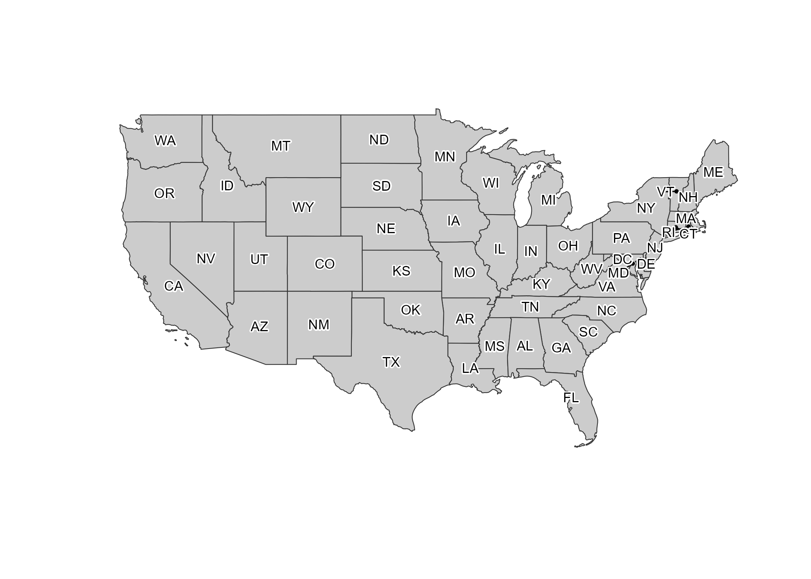
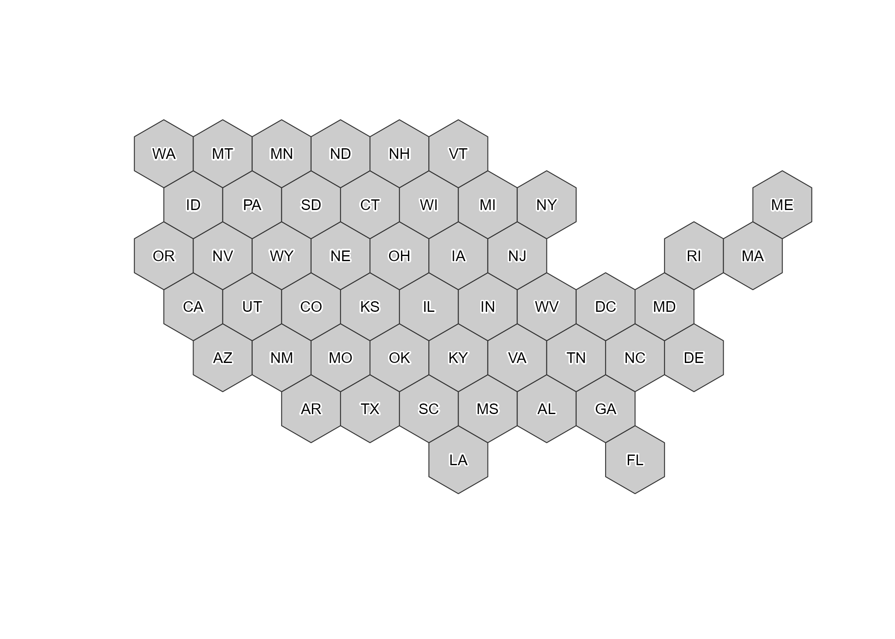
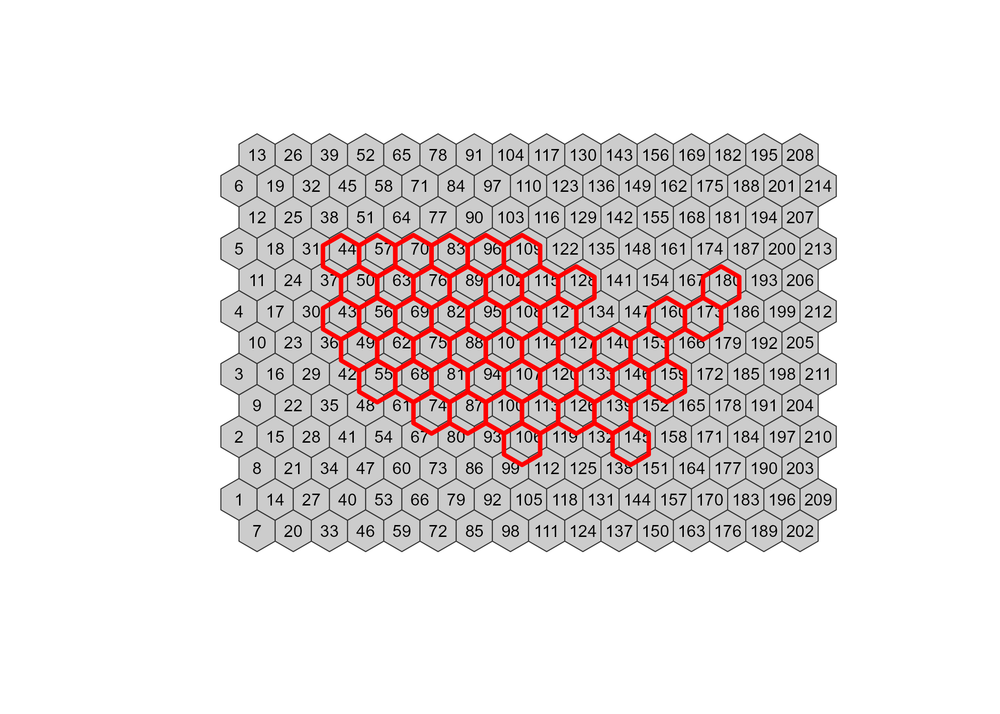
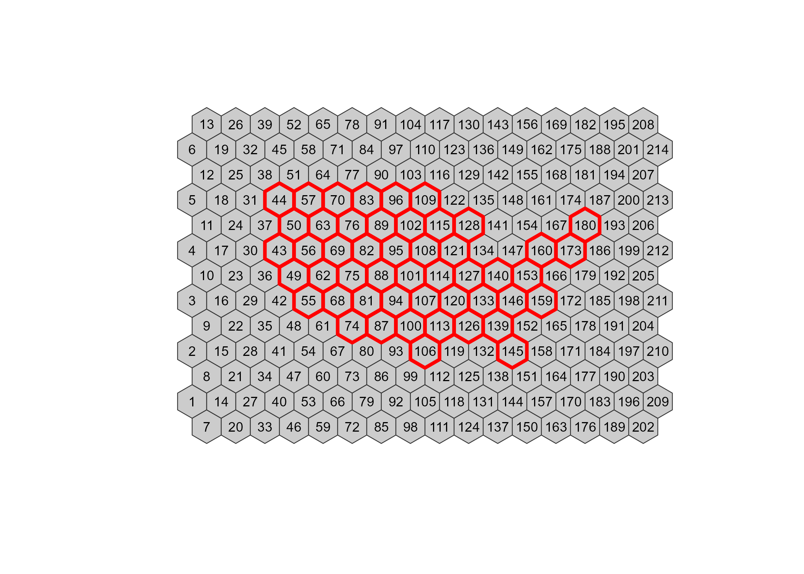
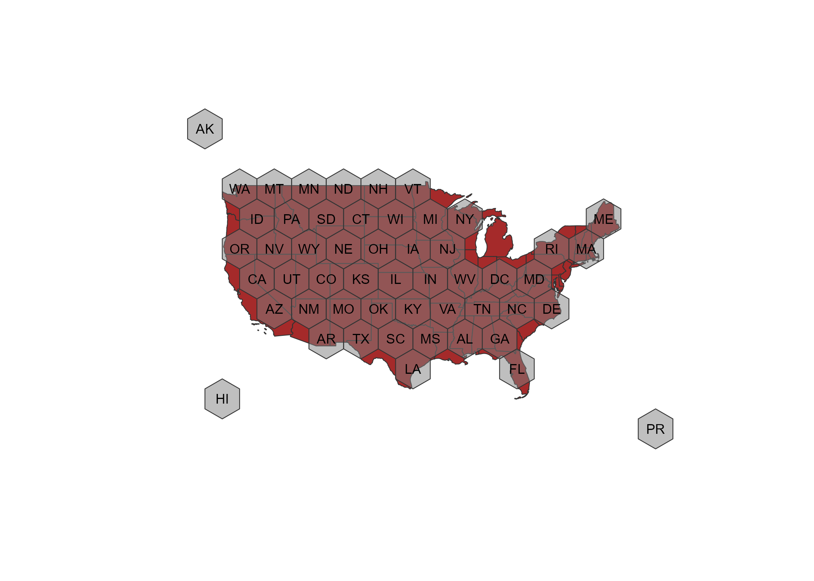

Create your own hexbin shapefiles
================

## How to create a hexbin grid with R with `geogrid`

A custom example:

``` r
# Needed libraries

library(USAboundaries)
library(geogrid)
library(sf)
library(dplyr)
# For plotting only
library(mapsf)


all <- states_contemporary_lores %>% st_transform(st_crs(3857))


# Get Mainland only

mainland <- all %>% filter(!state_abbr %in% c("AK", "HI", "PR"))

# Plot and check
mf_map(mainland) %>%
  mf_label(var = "state_abbr", overlap = FALSE, halo = TRUE)
```



``` r
# Create grid
# The grid is quite random - parameters that affects:
# - CRS of the shape
# - parameters seed and learning rate
#
# Play with them to improve the grid


cells <- calculate_grid(mainland,
  grid_type = "hexagonal",
  seed = 50,
  learning_rate = 0.1
)

mainland_new <- assign_polygons(mainland, cells)


mf_map(mainland_new) %>%
  mf_label(var = "state_abbr", overlap = FALSE, halo = TRUE)
```



``` r
# Expand the grid and manually assign values to Hawaii, Alaska and Puerto Rico

marea <- as.double(st_area(mainland_new[1, ]))
marea <- sqrt((2 * marea) / sqrt(3))
bbox <- st_bbox(mainland_new)
maxdist <- max(bbox[3] - bbox[1], bbox[4] - bbox[1]) * 0.05


grid <-
  st_make_grid(
    st_as_sfc(bbox + c(-maxdist, -maxdist, maxdist, maxdist)),
    crs = st_crs(mainland),
    cellsize = marea,
    square = FALSE
  )

grid <- st_sf(id = 1:length(grid), geometry = grid)

mf_map(grid) %>% mf_label("id")
mf_map(mainland_new, col = NA, border = "red", add = TRUE, lwd = 3)
```



``` r
# Align the grids - In this case using WA to 44

init <-
  grid %>%
  filter(id == 44) %>%
  st_centroid() %>%
  st_coordinates()

end <-
  mainland_new %>%
  filter(state_abbr == "WA") %>%
  st_centroid() %>%
  st_coordinates()

# Play with the offset!!
offset <- c(init[1] - end[1], init[2] - end[2])

newgrid <- sf::st_sf(
  sf::st_drop_geometry(grid),
  geometry = sf::st_geometry(grid) - offset,
  crs = sf::st_crs(grid)
) %>% st_transform(st_crs(mainland_new))

# Now grids should be aligned
mf_map(newgrid) %>% mf_label("id")
mf_map(mainland_new, col = NA, border = "red", add = TRUE, lwd = 3)
```



``` r
# Final step - manually assign grids id to Hawaii, Alaska and Puerto Rico
remain <- all %>%
  filter(state_abbr %in% c("AK", "HI", "PR")) %>%
  st_drop_geometry()
remain$id <- NA
remain[remain$state_abbr == "AK", "id"] <- 32
remain[remain$state_abbr == "HI", "id"] <- 34
remain[remain$state_abbr == "PR", "id"] <- 196

# Get geodata
remain_sf <- inner_join(newgrid, remain)

# Now paste all together
result <- bind_rows(mainland_new, remain_sf)
result <- st_make_valid(result)


# Regenerate initial df with new geometries
df <- st_drop_geometry(all)
destination <- result[, "state_abbr"]
result_end <- left_join(destination, df)

mf_map(result_end, col = NA, border = NA)
mf_map(mainland, col = "brown", add = TRUE)
mf_map(result_end, add = TRUE, col = adjustcolor("grey50", alpha.f = 0.5)) %>% mf_label("state_abbr", overlap = FALSE)
```



``` r
# Export to gpkg
# Mercator projection EPSG:3857
st_crs(result_end)
```

    ## Coordinate Reference System:
    ##   User input: WGS 84 / Pseudo-Mercator 
    ##   wkt:
    ## PROJCRS["WGS 84 / Pseudo-Mercator",
    ##     BASEGEOGCRS["WGS 84",
    ##         DATUM["World Geodetic System 1984",
    ##             ELLIPSOID["WGS 84",6378137,298.257223563,
    ##                 LENGTHUNIT["metre",1]]],
    ##         PRIMEM["Greenwich",0,
    ##             ANGLEUNIT["degree",0.0174532925199433]],
    ##         ID["EPSG",4326]],
    ##     CONVERSION["unnamed",
    ##         METHOD["Popular Visualisation Pseudo Mercator",
    ##             ID["EPSG",1024]],
    ##         PARAMETER["Latitude of natural origin",0,
    ##             ANGLEUNIT["degree",0.0174532925199433],
    ##             ID["EPSG",8801]],
    ##         PARAMETER["Longitude of natural origin",0,
    ##             ANGLEUNIT["degree",0.0174532925199433],
    ##             ID["EPSG",8802]],
    ##         PARAMETER["False easting",0,
    ##             LENGTHUNIT["metre",1],
    ##             ID["EPSG",8806]],
    ##         PARAMETER["False northing",0,
    ##             LENGTHUNIT["metre",1],
    ##             ID["EPSG",8807]]],
    ##     CS[Cartesian,2],
    ##         AXIS["easting (X)",east,
    ##             ORDER[1],
    ##             LENGTHUNIT["metre",1]],
    ##         AXIS["northing (Y)",north,
    ##             ORDER[2],
    ##             LENGTHUNIT["metre",1]],
    ##     USAGE[
    ##         SCOPE["Web mapping and visualisation."],
    ##         AREA["World between 85.06°S and 85.06°N."],
    ##         BBOX[-85.06,-180,85.06,180]],
    ##     ID["EPSG",3857]]

``` r
st_write(result_end, "USAhexbin.gpkg", delete_layer = TRUE)
```

    ## Deleting layer `USAhexbin' using driver `GPKG'
    ## Writing layer `USAhexbin' to data source `USAhexbin.gpkg' using driver `GPKG'
    ## Writing 52 features with 12 fields and geometry type Polygon.

``` r
sessionInfo()
```

    ## R version 4.0.3 (2020-10-10)
    ## Platform: x86_64-w64-mingw32/x64 (64-bit)
    ## Running under: Windows 10 x64 (build 19041)
    ## 
    ## Matrix products: default
    ## 
    ## locale:
    ## [1] LC_COLLATE=Spanish_Spain.1252  LC_CTYPE=Spanish_Spain.1252   
    ## [3] LC_MONETARY=Spanish_Spain.1252 LC_NUMERIC=C                  
    ## [5] LC_TIME=Spanish_Spain.1252    
    ## 
    ## attached base packages:
    ## [1] stats     graphics  grDevices utils     datasets  methods   base     
    ## 
    ## other attached packages:
    ## [1] mapsf_0.1.1         dplyr_1.0.5         sf_0.9-8           
    ## [4] geogrid_0.1.1       USAboundaries_0.3.1
    ## 
    ## loaded via a namespace (and not attached):
    ##  [1] Rcpp_1.0.6         pillar_1.6.0       compiler_4.0.3     class_7.3-18      
    ##  [5] R.methodsS3_1.8.1  R.utils_2.10.1     tools_4.0.3        digest_0.6.27     
    ##  [9] evaluate_0.14      lifecycle_1.0.0    tibble_3.1.0       R.cache_0.14.0    
    ## [13] lattice_0.20-41    pkgconfig_2.0.3    rlang_0.4.10       DBI_1.1.1         
    ## [17] rgdal_1.5-23       yaml_2.2.1         xfun_0.22          e1071_1.7-6       
    ## [21] styler_1.4.1       stringr_1.4.0      knitr_1.32         generics_0.1.0    
    ## [25] vctrs_0.3.7        systemfonts_1.0.1  rgeos_0.5-5        tidyselect_1.1.0  
    ## [29] classInt_0.4-3     grid_4.0.3         glue_1.4.2         R6_2.5.0          
    ## [33] textshaping_0.3.3  fansi_0.4.2        rmarkdown_2.7      sp_1.4-5          
    ## [37] purrr_0.3.4        magrittr_2.0.1     rematch2_2.1.2     units_0.7-1       
    ## [41] backports_1.2.1    ellipsis_0.3.1     htmltools_0.5.1.1  assertthat_0.2.1  
    ## [45] ragg_1.1.2         KernSmooth_2.23-18 utf8_1.2.1         proxy_0.4-25      
    ## [49] stringi_1.5.3      crayon_1.4.1.9000  R.oo_1.24.0
